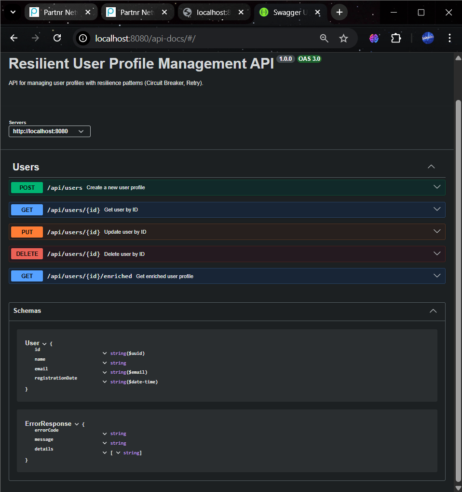
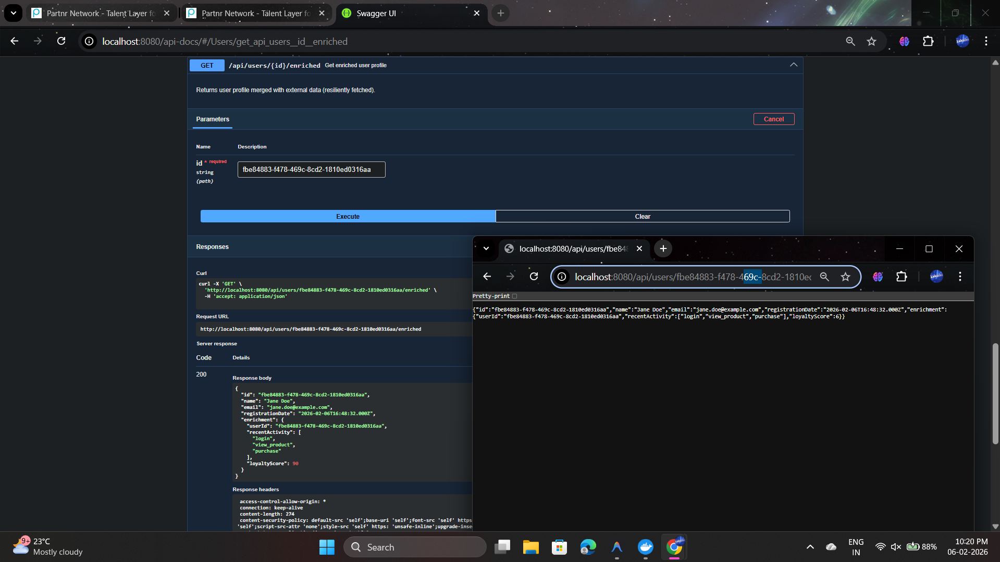
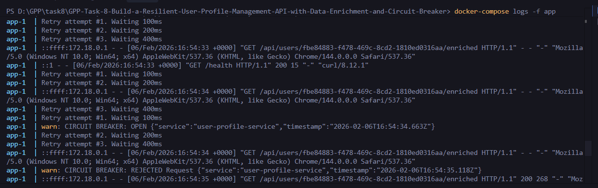
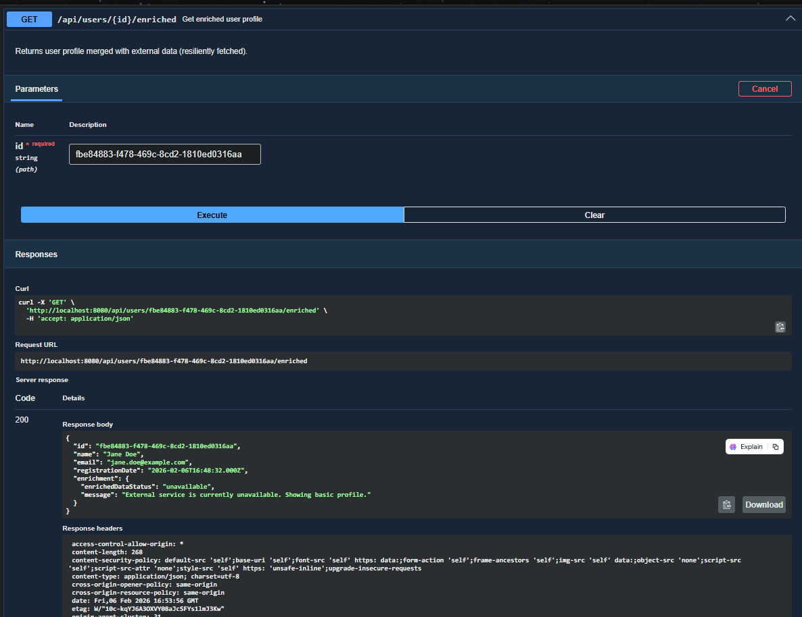
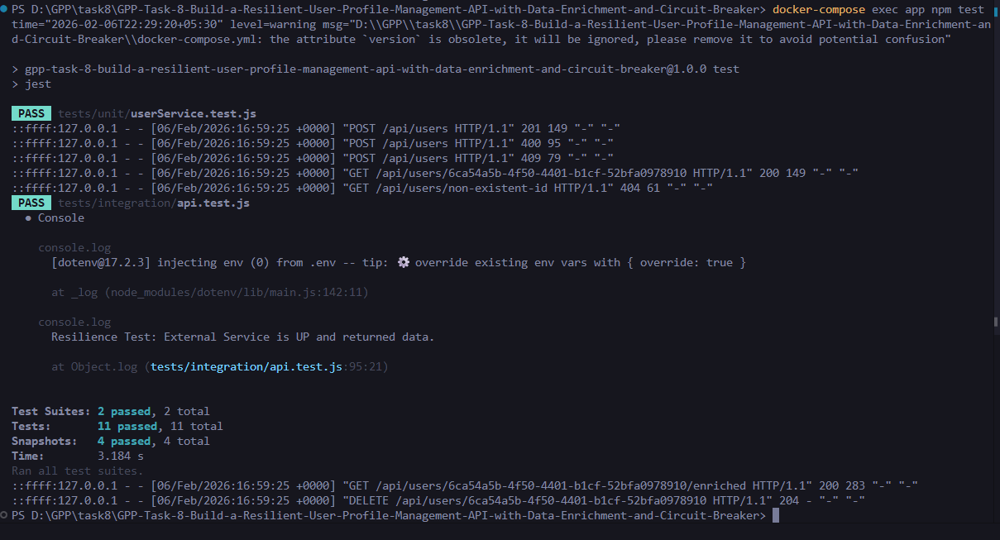

# Resilient User Profile Management API

A robust, containerized Node.js API for managing user profiles, featuring advanced resilience patterns (Circuit Breaker, Retry), Unit of Work architecture, and external data enrichment.

## 🚀 Key Features

- **User Management**: Full CRUD operations for user profiles.
- **Data Persistence**: MySQL database with Sequelize ORM.
- **Architectural Patterns**:
  - **Repository Pattern**: Abstraction layer for data access.
  - **Unit of Work**: Transaction management for atomic operations.
- **Resilience**:
  - **Circuit Breaker** (Opossum): Prevents cascading failures when the external enrichment service is down.
  - **Retry Mechanism** (Axios-Retry): Exponential backoff for transient network errors.
- **Enrichment**: Merges local user data with simulated external data.
- **Validation**: Strict input validation using Joi.
- **Documentation**: Interactive Swagger/OpenAPI UI.

## 🛠️ Technology Stack

- **Runtime**: Node.js (v18+)
- **Framework**: Express.js
- **Database**: MySQL 8.0
- **ORM**: Sequelize
- **Resilience**: Opossum (Circuit Breaker), Axios-Retry
- **Testing**: Jest, Supertest
- **Containerization**: Docker, Docker Compose

## 🏗️ Architecture & Design Decisions

### 1. Repository Pattern with Unit of Work
**Why**: To strictly decouple business logic from the persistence mechanism and ensure data integrity.
**Benefits**:
- **Testability**: Allows us to easily mock the database layer when unit testing the Service layer.
- **Maintainability**: Switching databases (e.g., MySQL to PostgreSQL) only requires changes in the Repository implementation, not the logic.
- **Atomicity**: The Unit of Work ensures that operations like "Create User" are either fully completed or fully rolled back (ACID properties), preventing partial data states.

### 2. Resilience Patterns (Enrichment Service)
The system integrates with a "potentially unreliable" external service. We implemented a robust defense strategy:

#### Circuit Breaker (Opossum)
- **Mechanism**: Wraps external calls. If failures exceed a 50% threshold or the service times out repeatedly, the circuit moves to `OPEN` state.
- **Why**: Prevents "Cascade Failures". If the external service hangs, our API shouldn't hang with it. It fails fast, freeing up threads/resources.
- **Benefit**: Ensures the core User API remains responsive even when the Enrichment subsystem is dead.

#### Retry Mechanism (Exponential Backoff)
- **Mechanism**: Uses `axios-retry`. If a request fails (network error or 5xx), it retries 3 times with specific delays: 100ms, 200ms, 400ms.
- **Why**: Distinguishes between "outage" and "blip". A temporary network packet loss shouldn't cause a user error.
- **Trade-off**: Increases latency for the failed request (Total Wait = ~700ms + timeouts), but significantly improves success rates for transient errors.

#### Fallback Strategy
- When the Circuit Breaker is open or retries validly fail, the system returns `{ enrichedDataStatus: 'unavailable' }` instead of a 500 Error. This allows the frontend to show the user their profile, perhaps with a "Enrichment data currently unavailable" warning, rather than a blank screen.

## 📸 System Demonstration

### 1. API Overview & Documentation
*Interactive Swagger UI showcasing the comprehensive endpoint suite.*

*(Place screenshot of http://localhost:8080/api-docs here)*

### 2. Distributed Data Enrichment (Happy Path)
*Seamlessly merging local user profile data with external enrichment service data.*

*(Place screenshot of GET /api/users/{id}/enriched success response)*

### 3. Resilience in Action (Circuit Breaker Logs)
*Demonstrating **Self-Healing Architecture**. The system detects failures, opens the circuit, and prevents cascading outages.*

*(Place screenshot of terminal showing: "Retry attempt...", "CIRCUIT BREAKER: OPEN")*

### 4. Graceful Degradation (Fallback Strategy)
*User experience protection during outages. The API remains responsive (200 OK) even when dependent services fail.*

*(Place screenshot of GET /api/users/{id}/enriched returning "enrichedDataStatus": "unavailable")*

### 5. Quality Assurance
*Comprehensive test suite covering Integration, Unit, and Resilience scenarios.*

*(Place screenshot of `npm test` results showing all green checks)*

## ⚙️ Setup & Installation

### Prerequisites
- Docker & Docker Compose

### Running the Application

1.  **Clone the repository**
2.  **Start Services**:
    ```bash
    docker-compose up -d --build
    ```
    This starts:
    - `app` (API Service) on port **8080**
    - `db` (MySQL) on port **3307**
    - `mock_enrichment_service` on port **8081**

3.  **Verify Status**:
    Check if services are healthy:
    ```bash
    docker-compose ps
    ```

    To verify the Mock Service directly from your browser, use:
    > **http://localhost:8081/enrich/user-1**
    *(Note: You must use `localhost` from your browser, but the app uses `mock_enrichment_service` internally)*

## 📖 API Documentation

Once running, access the **Swagger UI** at:
> **http://localhost:8080/api-docs**

For a static reference, see [API Documentation (Markdown)](api-docs.md).

### Key Endpoints
- `POST /api/users` - Create User
- `GET /api/users/{id}` - Get User
- `GET /api/users/{id}/enriched` - Get Resilient Enriched Profile
- `PUT /api/users/{id}` - Update User
- `DELETE /api/users/{id}` - Delete User

## 🧪 Testing

### 1. Run Tests via Docker (Recommended)
This ensures consistent results by running tests inside the container.

```bash
docker-compose exec app npm test
```
*Runs tests inside the container. Because we use volume mounts, generated snapshots are automatically synced to your host `tests/integration/__snapshots__`* folder.*

### 2. Run Tests Locally
To run tests on your host machine:

1.  **Ensure Services are Running**: `docker-compose up -d db mock_enrichment_service`
2.  **Set Environment Variables**:
    *   `DB_HOST=localhost`
    *   `DB_PORT=3307`
    *   `EXTERNAL_SERVICE_URL=http://localhost:8081/enrich/{id}`
3.  **Run**: `npm test`

## 📂 Project Structure

```
src/
  config/         # Database configuration
  controllers/    # Request handlers (Input validation, Response formatting)
  services/       # Business logic (Enrichment, Service orchestration)
  repositories/   # Data access layer
    interfaces/   # Repository interfaces
    impl/         # Sequelize implementations (Repo + UnitOfWork)
  models/         # Sequelize Models
  external/       # External API Clients (Circuit Breaker/Retry logic)
  middleware/     # Error handling, etc.
  routes/         # API Routes
tests/
  integration/    # Integration tests for API endpoints
```
